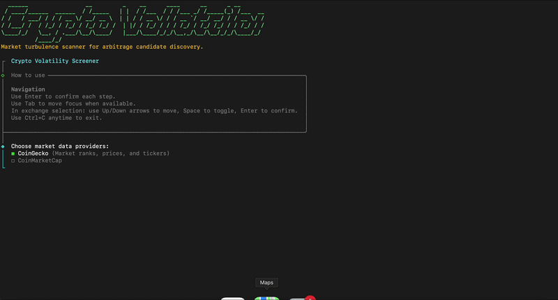

# volat-screener

> Interactive CLI for finding high-volatility crypto assets across configurable market-cap ranges and exchange filters.

Designed for arbitrage and market-scanning workflows — run a guided terminal wizard, pick your providers and filters, and get a ranked list of volatile assets in seconds.



---

## Features

- Step-by-step terminal wizard powered by `@clack/prompts`
- Multi-provider market data architecture (CoinGecko, CoinMarketCap)
- Exchange-aware screening with `any` / `all` match modes
- Optional CSV export of results
- Persistent credential storage — set up once, reuse forever

---

## Quick Start

### Option 1 — Run once, no installation

Launches the screener immediately without installing anything permanently:

```bash
npx volat-screener
```

### Option 2 — Install globally, run anytime

Downloads and installs the CLI once. After that you can run it anytime just by typing `volat-screener`:

```bash
npm install -g volat-screener
```

Then launch it whenever you need it:

```bash
volat-screener
```

---

On first launch (either option) the setup wizard will ask for your API keys and save them — you won't need to enter them again.

---

## Requirements

- Node.js `20+`
- A free [CoinGecko API key](https://www.coingecko.com/en/api) (demo plan works)
- Optionally a [CoinMarketCap API key](https://coinmarketcap.com/api/)

---

## Usage

### Run the screener

```bash
volat-screener
```

You will be prompted to choose:

1. Market data providers
2. Market-cap rank range
3. Minimum volatility threshold
4. Number of results to show
5. Target exchanges
6. Exchange match mode: `any` or `all`
7. Optional CSV export

### Manage saved credentials

```bash
volat-screener config
```

Opens the credential wizard so you can add, rotate, or remove API keys.

---

## Configuration

Copy `.env.example` to `.env` if you prefer environment variables over saved config:

```bash
cp .env.example .env
```

### Supported Variables

```env
COINGECKO_API_KEY=your_coingecko_api_key_here
COINGECKO_API_PLAN=demo
COINMARKETCAP_API_KEY=your_coinmarketcap_api_key_here
```

### Credential Resolution Order

1. Environment variables (`.env` or shell)
2. Persistent local config saved by `volat-screener config`
3. Setup wizard input at first launch

### Notes

- `COINGECKO_API_KEY` is required when using the CoinGecko provider.
- `COINGECKO_API_PLAN` must be `demo` or `pro`.
- `COINMARKETCAP_API_KEY` is required when using the CoinMarketCap provider.
- CoinGecko must be included for full screening — it provides 24h high/low and exchange ticker data used by the volatility and exchange filters.
- CoinMarketCap contributes additional market data into the merged result set but does not currently satisfy all filter requirements on its own.

---

## Local Development

```bash
git clone https://github.com/KokorinPetr/volat-cli.git
cd volat-cli
npm install
npm run start
```

### Useful Scripts

| Command | Description |
|---|---|
| `npm run start` | Run with `tsx` (no build step) |
| `npm run dev` | Same as start |
| `npm run typecheck` | Type-check without emitting |
| `npm run build` | Compile to `dist/` |

### Link locally as `volat-screener`

```bash
npm run build
npm link
volat-screener
```

---

## Project Structure

```text
src/
  config/
    exchanges.ts       # Exchange options and provider-specific aliases
  engine/
    ScreenerEngine.ts  # Core screening logic
  providers/
    coingecko.ts
    coinmarketcap.ts
    index.ts
  types/
    index.ts           # Shared interfaces: MarketCoin, CoinTicker, etc.
  aggregation.ts       # Multi-provider result merging
  enrichment.ts
  export.ts            # CSV export
  prompts.ts           # Wizard UI
  table.ts             # Terminal table rendering
  app.ts
  index.ts
```

---

## Adding New Providers

The architecture is designed so new providers can be added without touching the screening engine.

### Provider Contract

Implement the `MarketDataConnector` interface from [`src/types/index.ts`](./src/types/index.ts):

| Member | Description |
|---|---|
| `id` | Unique provider identifier |
| `label` | Display name |
| `supportsVolatilityData` | Whether provider supplies high/low data |
| `supportsExchangeTickers` | Whether provider supplies exchange listings |
| `fetchCoinsForRankRange(config)` | Fetch coins by market-cap rank |
| `fetchCoinTickers(coinId, exchangeIds?)` | Fetch exchange ticker data |

### Steps to Add a Provider

1. Create a connector in [`src/providers/`](./src/providers) — see [`coingecko.ts`](./src/providers/coingecko.ts) as a reference.
2. Register it in [`src/providers/index.ts`](./src/providers/index.ts).
3. Add selectable metadata to [`src/constants.ts`](./src/constants.ts).
4. Add environment variable handling to [`src/env.ts`](./src/env.ts).

Providers normalize external responses into `MarketCoin` and `CoinTicker`. When multiple providers return the same asset, [`src/aggregation.ts`](./src/aggregation.ts) merges them — deduplicating coins, averaging numeric fields, and preserving per-provider metadata.

### Exchange Configuration

All exchange options and provider-specific ID aliases (e.g. `OKX` vs `okex`) live in [`src/config/exchanges.ts`](./src/config/exchanges.ts). This is the single place to update when adding or fixing exchange support.

---

## Contributing

Contributions are welcome — bug reports, new provider connectors, filter improvements, or documentation fixes.

See [CONTRIBUTING.md](./CONTRIBUTING.md) for the full guide, including how to add providers, fix exchange mappings, and what to check before opening a PR.

Have a feature idea or just want to share feedback? [Open an issue](https://github.com/KokorinPetr/volat-cli/issues) or reach out directly at [kokorin.petr27@gmail.com](mailto:kokorin.petr27@gmail.com).

**If this project is useful to you, please consider giving it a star — it helps others find it and motivates continued development.**

---

## License

MIT — see [LICENSE](./LICENSE).
